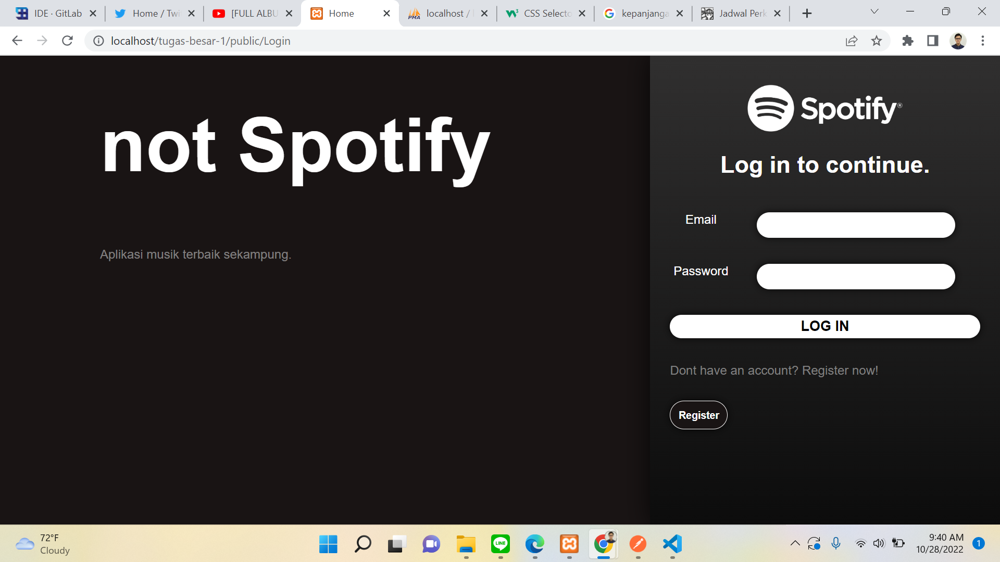

# Deskripsi

Binotify merupakan aplikasi streaming musik online berbasis web. Aplikasi ini dibuat menggunakan bahasa PHP pada server side dan HTML, CSS, serta Javascript pada client side. Aplikasi ini memiliki 2 role yaitu user (sebagai pengguna) dan admin (sebagai pengelola). Terdapat 3 fitur utama yang dapat dibreakdown menjadi fitur-fitur lainnya, yaitu:

1. Autentikasi Pengguna
2. Pengelolaan Lagu dan Album (Admin)
3. Pencarian Lagu (Admin dan User)

# Requirement

- XAMPP(X (tempat sistem operasi apapun), Apache, MySQL, PHP dan Perl)
- HTML, CSS, Javascript

# Cara Instalasi

Install XAMPP, pastikan port untuk Apache dan MySQL tersedia.

# Cara Menjalankan Server

1. Clone repository pada folder `xampp/htdocs/`
2. Nyalakan Apache dan MySQL pada XAMPP Control Panel
3. Setup database dengan mengimport database pada `data/tubes-wbd.sql` (disarankan menggunakan phpmyadmin)
4. Setting host, nama, username dan password database pada `app/models/Config.php`
5. Jalankan http://localhost/binotify-app/public

# Screenshot

## Halaman Login

## Halaman Register

## Halaman Home

## Halaman Daftar Album

## Halaman Search, Sort, and Filter

## Halaman Detail Lagu

## Halaman Detail Album

## Halaman Tambah Lagu dan Album

## Halaman Daftar User

## Halaman Penyanyi Premium

# Pembagian Tugas

## Server Side

1. Halaman Login : 13520085
2. Halaman Register : 13520085
3. Halaman Home : 13520148
4. Halaman Daftar Album : 13520148
5. Halaman Search, Sort, and Filter : 13520148
6. Halaman Detail Lagu : 13520085
7. Halaman Detail Album : 13520085
8. Halaman Tambah Lagu dan Album : 13520061
9. Halaman Daftar User : 13520061

## Client Side

1. Halaman Login : 13520061
2. Halaman Register : 13520061
3. Halaman Home : 13520148
4. Halaman Daftar Album : 13520148
5. Halaman Search, Sort, and Filter : 13520148
6. Halaman Detail Lagu : 13520085
7. Halaman Detail Album : 13520085
8. Halaman Tambah Lagu dan Album : 13520061
9. Halaman Daftar User : 13520061
